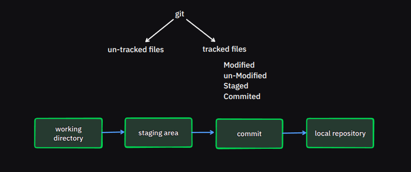
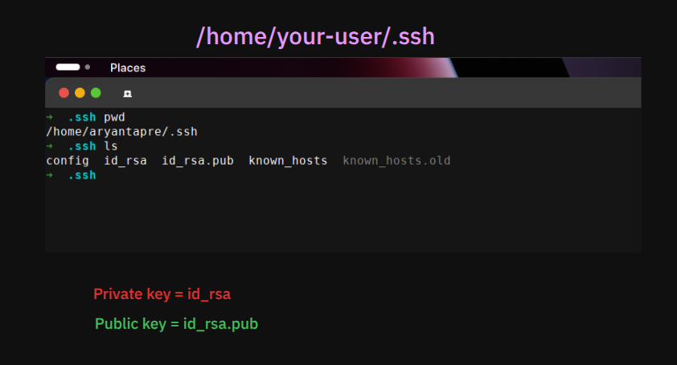
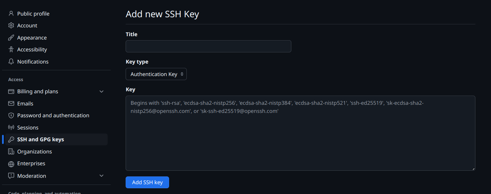
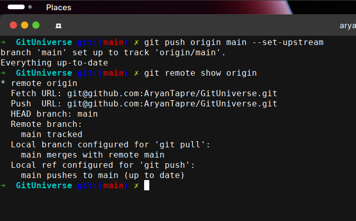
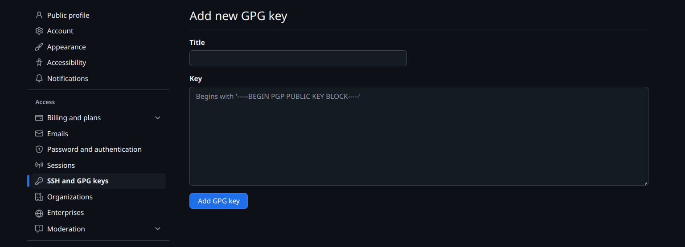

**Tracked files**
: Files that were in last snapshots, or newly staged file.

**Untracked Files**
: Files that were not part of last snapshot/commit, or not included in staging area before.

---

## :new: :wrench: Git setup -- Never used before on local machine

> Configure user details (*username* and *email*).
> 
- git config --global user.name <user_name> 
- git config --global user.email <user_email>

> Setting up default text editor
> 
- git config --global core.editor <editor_name>

> Setting up default branch to **main**
> 
- git config --global init.defaultBranch main

---

#### Must know commands as developer

> Check current state of repository
>
- git status

> Add files to staging area
>
- git add <file_name> (*adding single file*)
- git add . (*adding all filesx`*)

> Unstage files from staging area / index
> 
- git restore --staged <file_name>

> Display repo status in short
> 
- git status --short

> shows changes made to file who not in staging area
> 
- git diff

> shows changes made to file who in staging area
> 
- git diff --staged

> Commit files currently staged
>
- git commit -m "<commit_message>"
- git commit (*opens default editor to type commit msg

> Skip staging area --direct commit
> 
- git commit -a -m "<commit_message>"

> Remove files from git control, deleting it
>: does auto stage and commit for us
- git rm <file_name> (**)

> Renaming a file
>
- git mv <old_file_name> <new_file_name>

---

#### Working with *dotgitignore* files

- :warning: <ins>**what git does**</ins>: If file to ignore by git is already committed / tracked, even after adding it's name to .gitignore file git refuses to ignore it.

- Firstly add <file_name> in .gitignore file

- untrack file using below command
    - git rm --cached <file_name>

- commit the changes

---

#### Let's see some git history commands

> List all commits uptill now
>
- git log

> List all commits with file content differences
>
- git log --patch

> List commits customize to display
>
- git log <number> (*git log 2 : will display last two commits*)

> Show commits log in various formaots
> 
- git log --pretty = fuller/full/oneline/short

> Display log since particular date (yyyy-mm-dd)
> 
- git log --since="yyyy-mm-dd"

> Display log untill particular date (yyyy-mm-dd)
> 
- git log --untill="yyyy-mm-dd"

> Display log before particular date (yyyy-mm-dd)
> 
- git log --before="yyyy-mm-dd"

> Display log after particular date (yyyy-mm-dd)
> 
- git log --after="yyyy-mm-dd"

---
#### Git undoing changes

> To rewrite the commit
>: If you want to redo the commit, make additional changes you forget stage them and commit again use --amend option 

*As an example, if you commit and then realize you forgot to stage the changes in a file you wanted to add to this commit, you can do something like this:*

-  git commit -m <Initial commit>
   git add forgotten_file 
   git commit --amend 

> Unstage files, effectively removing them from staging area
>
- git restore --staged <file_name>

> Undo content of any file tracked by git
>: Discard local changes and revert back to last committed state 
- git restore <file_name>

> Reverse changes of the commit
> 
- git revert <commit_hash>

---

#### Working with Remotes
***
short_name = abberavation of remote URL
***  

> Add URL to local repository of your remote repository (gitHub)
>
- git remote add <Short_name> <URL>
   - git remote add origin `git@github.com`:AryanTapre/GitUniverse.git 

***git remote -v*** : shows current push and pull URL

> Download data from remote
>: updates localBranch with that of remote, but does'nt automatically merge to changes local branches
- git fetch <short_name>

> Fetch + merge remote changes to local branch
>: If your current local branch is setup to track remote branch use this command, --automatically fetches and merge that remote branch to local branch 
- git pull <short_name>

> Pushes local branch changes to remote branch
>: Only works if you have ***write access*** to remote project, proper authentication and n/w connectivity
- git push <short_name> <branch_name>

> Inspect remote branches locally
>
- git remote show <short_name>

> Rename <short_name> for remote repository
>
- git remote rename <old_short_name> <new_short_name>

> Remote <short_name> / remote from local repo
>
- git remote remove <short_name>

> Establish relationship with local and remote branch
>: used while pushing changes to remote, no need to mention <short_name> and <branch_name> is setted
- git remote push <short_name> <branch_name> --set-upstream

---

#### Working with Tags --A special pointer to commit

> List all tages available
>
- git tag --list

> Creating new *annotaed* tag
>
- git tag -a <tag_name> -m "<tag_message>"

> Display tag details
>
- git show <tag_name>

> Pushing tags to remote repository
>: by default git creates tags only for local branch, not remote
- git push <short_name> <branch_name> <tag_name>

> Deleting tag in local branch
> 
- git tag --delete <tag_name>

> Deleting tag from remote repositiory / branch
> 
- git push <short_name> <branch_name> --delete <tag_name>

---

#### Working with alias --short names for command

> Creating and setting alias in global config

---

#### Working with Branches

> Creating new branch
>
- git branch <branch_name>

> Switching to existing branch
> 
- git switch <branch_name>

> Create new branch, and switch to it immediately
> 
- git switch --create <branch_name>

> List all available branches 
> 
- git branch

----

#### Comprehending *foundations* of Branching & Merging

> To merge a branch onto the current branch
>
- First switch to your current branch, and run
- git merge <branch_name>

> Delete branch from local machine
>
- git branch --delete <branch_name>

> Delets branch from Remote (gitHub)
>: :warning: First delete branch locally
- git push <short_name> --delete <branch_name>

> print last commit of all branches
>
- git branch -v 

> Filter newly merged branches to your local(current) branch
>
- git branch --merged

>  Filter list branches that are not merged yet
>
- git branch --no-merged

> To forcefully delete branch even though not merged
>
- git branch -d <branch_name>

> List all the branches setted locally and remotely
>
- git branch --all

> To rename branch locally
>
- git branch --move <old_branch_name> <new_branch_name>

> To rename branch remotely --onces locally renamed it
> 
- First delete branch from remote (git push origin --delete <branch_name>)
- Push new branch to remote
- verify remote branch by listing (git branch --all)

> ***Sync local branch with remote***
>: Fetches updates from the remote repository (new branches, updates, etc.).

Removes stale remote-tracking branches that no longer exist on the remote.
- git fetch --prune

***
<ins>Understanding Merge</ins>
***

***Fast forward merge =>***
 
 

 

***Three way merge =>***

 

 

 *Git uses a three-way merge when combining changes from two branches that have diverged from a common ancestor, typically during a merge operation, to reconcile differences and create a new merge commit.*

==Three-Way Merge Process:==

Step 1: Identify the common ancestor commit (A).

Step 2: Compare changes made in the current branch (C) and the feature branch (B) relative to A.

Step 3: Combine those changes into a new merge commit.

---

#### Working with Rebasing

*
Rebasing in Git is the process of moving or reapplying a branch's commits on top of another base commit, typically to maintain a linear history or integrate upstream changes, by rewriting the commit history.
*

***What happened?***

    1. In git commits are immutable snapshots (can't alter/modifty)
	2. We want to rebase 'bough' branch onto 'main' branch
	3. Firstly --git identify unique commits of bough branch that are B1 and B2
	4. Copies content of B1 & B2, makes commit where main branch pointer  is referring to (A3) a base for replaying (rewrtting)
	5. Here, git creates new commits named as B1' and B2' with content of original ones
	6.  Now parent of B1' becomes A3
	7. Original B1 and B2 commits are unreferenced ---stored at git database, managed by 'reflog' file [tracking them]
	8. for the span of 30 days they will sustain there --- as time expires get killed by garbageCollector (GC)   

***Some usefull commands***

> rebasing command
>: (currently in bough branch) git rebase main  (rebase bough into main branch)
- git rebase main

> To recover old commits
>: to recover old commits /branch (B1 and B2 )
- git reset --hard <commit_hash>  # old hash of commit B2 from reflog file
			(This moves Bough back to B2, restoring the original history.)

> to keep changes, without undoing rebase
>
- git branch <branch-name> <commit> # old commit of B2 from reflog file

---

#### Rules for any remote communication protocols

---

#### How to setup Remote repository --gitHub

> **1.	initialize local git repository**
-	git init

> **2.	Generate SSH key pairs(public and private) on local machine**
-	ssh-keygen -t rsa -b 4096 -C "your_email@example.com"   
	
	`-t rsa` -> Specifies RSA as key type
	`-b 4096` -> Generates a 4096-bit key (*more secure than default 2048-bit*)
	`-C "your_email@example.com"` -> Adds a comment to identify the key

> **3.	Add the SSH key to SSH Agent (*optional*)**
- Start the SSH agent
	: eval "$(ssh-agent -s)"
- Add your private key
	: ssh-add ~/.ssh/id_rsa

> **4.	Copy the Public key (*For Authentication*)**
- cat ~/.ssh/id_rsa.pub | xclip -selection clipboard (*copies key onto clipboard*)

> **5. Paste onto the Remote Server --gitHub**

> **6.	Verify remote by pushing**

---

### How to setup GPG(*GNU private guard*) keys

GPG (GNU Privacy Guard) keys are used to sign Git commits and tags, proving that they were created by you. GitHub displays a "Verified" badge next to signed commits, adding authenticity.
  

> **1.	Install GPG**
-	sudo apt install gnupg

> **2.	Generate a GPG key**
-	gpg --full-generate-key 
 

	*Key Configuration Prompts*
		Select Key Type: Choose RSA and RSA (default).

		- Choose Key Size: Type 4096 (for better security).

		- Set Expiration: Type 0 (never expire) or set a validity period.

		- Enter Your Identity:

		- Name: Use your GitHub name.

		- Email: Use your GitHub email (your_email@example.com).

		- Comment: (Optional, press Enter to skip).

		- Set a Passphrase: Choose a secure one (used when signing commits).

		- Once completed, it will generate a key pair (private + public).

 

> **3.	Get your GPG key ID**
-	gpg --list-secret-keys --keyid-format=long

	:	You'II see output like:
	:	``sec   rsa4096/3AA5C34371567BD2 2025-03-27 [SC]``
	:   Here, ``3AA5C34371567BD2`` is your GPG Key ID.

> **4.	Export the Public Key**
-	gpg --armor --export 3AA5C34371567BD2

	:	You'II see output like:
	:	``-----BEGIN PGP PUBLIC KEY BLOCK-----``
		``...``
		``-----END PGP PUBLIC KEY BLOCK-----``
	*Copy everything (including the headers)*

> **5.	Add GPG key to 	GitHub**

> **6.	Configure Git to Sign commits**

-	``git config --global user.signingkey 3AA5C34371567BD2``
-	``git config --global commit.gpgsign true``

> **7.	Test a Signed Commit**

-	git commit -S -m "This is a signed commit"

	: To verify Signature
	: ``git log --show-signature``

